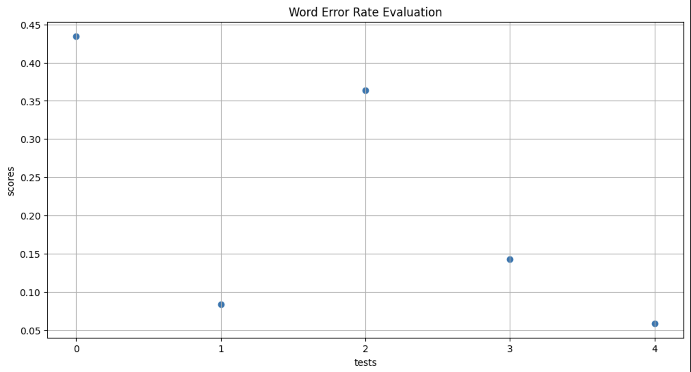
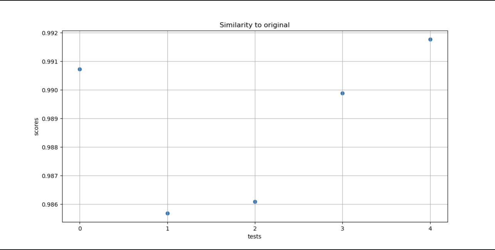

# Оценка модели синтеза речи parler-tts-mini-jenny-30H

Данный код будет воспроизводить оценку модели parler-tts-mini-jenny-30H по нескольким метрикам. Версия google
colab - https://colab.research.google.com/drive/1yWYI4657jodDJddKN1SLfbQ6hXRAe7lu#scrollTo=g8o4o0AzlPIQ

---

## Содержание

1. [Сценарии оценивания](#сценарии-оценивания)
2. [Выбранные метрики и аудиозаписи](#установка)
3. [Результаты оценивания](#результаты-оценивания)
4. [Зависимости](#зависимости)
5. [Установка среды](#установка-среды-и-программы)
6. [Запуск программы](#запуск-программы)

---

## Сценарии оценивания

Предполагается 3 сценария оценивания:

1) Проверка стандартного функционала. Она предполагает, что модель правильно синтезирует текст в речь на уровне
   возможности разбора слов.
2) Объективная оценка. В этой секции будем сравнивать аудиозаписи, полученные моделью и целевые на схожесть. Будут
   оцениваться такие характеристики как: уровень искажений сигнала, временные сдвиги сигнала, уровень шума, схожесть
   голоса.
3) Субъективная оценка. Так как нет возможности опросить людей о качестве звука и речи в получаемых моделью аудизаписях,
   воспользуемся одной из синтетических моделей, которые предсказывают оценки людей по разным критериям.

---

## Выбранные метрики и тестовые примеры

1. Проверка стандартного функционала будет выполняться с помощью метрики WER (Word Error Rate). Для этого необходимо
   использовать другую модель, обученную переводить речь в текст. В данной работе была выбрана модель -
   whisper-large-v3-turbo на 800M параметров. Тексты, на которых мы будем проводить тестирование, могут быть
   произвольными, так как
   оценка будет объективней, если модель не видела выбранные фразы в процессе своего обучения.
2. Для объективной оценки используем следующие метрики: PESQ (Perceptual Evaluation of Speech Quality), SI-SDR (
   Scale-Invariant Signal-to-Distortion Ratio), STOI (Short-Time Objective Intelligibility). PESQ измеряет качество
   речи, воспринимаемое человеком, сравнивая оригинальный и обработанный (например, очищенный от шума) сигнал. SI-SDR
   измеряет, насколько хорошо восстановленный сигнал (например, речь) соответствует оригиналу, игнорируя различия в
   масштабе (громкости). STOI измеряет разборчивость речи на основе кратковременного анализа (по фрагментам), сравнивая
   спектры оригинального и обработанного. Размеченные фразы возьмем из датасета Jenny, предположительно модель должна
   показать хорошие значения метрик, так как на этих данных она обучалась (скорее всего, так как в Jenny нет разбиения
   на тренировочную и тестовую выборку, есть и шанс, что взятые примеры будут из тестовой выборки разработчиков). Также
   в объективную оценку включим метрику схожести оригинальной и сгенерированной аудиозаписи (SIM-O), расчитанную с
   помощью
   обученной модели WavLM-Base, которая формирует из аудиозаписи вектор признаков. Схожесть векторов признаков будем
   высчитывать с помощью косинусного расстояния (варьируется от -1 до 1, -1 - признаки не похожи и противонаправлены,
   1 - признаки
   схожи и сонаправлены).
3. Субъективная оценка будет проводиться посредством метрики DNSMOS (Deep Noise Suppression Mean Opinion Score).
   Простыми словами, DNSMOS предсказывает, как бы люди оценили работу нашей модели по шкале от 1 до 5.

### Результаты оценивания

- Метрика Word Error Rate на 5 фиксированных примерах из кода:
  
  Диаграмма показывает, что на тестах среднее значение WER составило ±0.2. Это является неплохим показателем, если
  учитывать, что модель Speech-To-Text также всегда имеет свои погрешности.
- Объективные метрики: PESQ, SI-SDR, STOI на 5 рандомных примерах из датасета Jenny:
    
  Данные метрики неожиданно показали низкое значение качества.
  Главной причиной такого результата, скорее всего, являются временные сдвиги, то есть паузы в синтезированной речи не
  совпадают с паузами в оригинальных сэмплах, из-за чего оценка метрик портится. При этом PESQ показал довольно хорошее
  значение, если не учитывать сдвиги, что говорит о том, что модель синтезирует речь хорошего качества. SI-SDR показал
  большие отрицательнеые значения, это неудивительно, ведь он больше всех чувствителен к сдвигам во времени. STOI
  продемонстрировал значения чуть ниже среднего, однако их тоже можно интерпретировать, как неплохой результат (из-за
  смещений синтезированного аудио во времени), следовательно речь довольно разборчива.
  
  Значения метрики SIM-O показывают значение, неразличимые от 1. Это означает, что модель высококлассно справляется с
  синтезом, и сгенерированные аудиозаписи почти не отличаются от оригинальных.
- Метрика Deep Noise Suppression Mean Opinion Score на 5 фиксированных примерах из кода:
  
  Значения оченки качества сигнала (Signal Quality) варьируются в диапазоне 3.6 - 3.8. Значения оценки шумов (Background
  Noise) во всех тестах лежат в окрестности 4.2. Лингвистическая оценка (Linguistic) находится в диапазоне от 3.3 до
  3.6. Общая оценка - от 3.9 до 4.3. Данные показатели говорят о том, что генерируемые аудиозаписи хорошо оценились бы
  реальными людьми. Сделаем вывод, что качество сигнала довольно высокое, шумы практически отсутсвуют (при должном
  описании синтеза), качество речи (акцент) выше среднего.

## Зависимости

Для работы проекта необходимы следующие библиотеки и их версии:

- `torch==2.5.1` — Библиотека для работы с нейронными сетями.
- `soundfile==0.12.1` — Библиотека для чтения и записи аудиофайлов.
- `transformers==4.46.1` — Библиотека от Hugging Face для работы с трансформерами.
- `torchmetrics==1.5.2` — Библиотека метрик для PyTorch.
- `jiwer==3.0.5` — Инструмент для вычисления метрик ошибок текста, таких как WER (Word Error Rate), который используется
  для оценки качества распознавания речи.
- `pandas==2.0.3` — Библиотека для анализа и манипуляции данными, особенно табличными данными (DataFrame). Она
  предоставляет удобные структуры данных для обработки больших объемов данных
- `requests==2.31.0` — Популярная HTTP-библиотека для взаимодействия с веб-сервисами через API. Используется для
  получения и отправки данных через HTTP-запросы.
- `numpy==1.24.3` — Основная библиотека для научных и численных вычислений. Используется для работы с многомерными
  массивами данных и выполнения математических операций.
- `matplotlib==3.7.2` — Библиотека для визуализации данных, позволяющая создавать графики, диаграммы и другие виды
  графического представления информации.
- `librosa==0.10.2.post1` — Библиотека для анализа и обработки аудиосигналов. Предоставляет функции для изменения
  частоты дискретизации, извлечения признаков и других операций с аудиофайлами.
- `pesq==0.0.4` — Библиотека для расчета метрики pesq
- `onnxruntime==1.20.1` — Высокопроизводительная библиотека для выполнения моделей машинного обучения в формате ONNX на
  различных платформах с поддержкой оптимизаций и аппаратного ускорения.
- `accelerate==1.2.0` — Библиотека для Python, упрощающая распределённое обучение и использование ускоренных вычислений
  на GPU/TPU, с минимальным изменением исходного кода

### Установка и подготовка среды

1. Установка среды:

```bash
python -m venv .venv
```

2. Активация среды:

- На Windwos:

```bash
.venv\Scripts\Activate
```

- На MacOS/Linux:

```bash
source .venv\bin\activate
```

3. Установка зависимостей:

```bash
pip install -r requirements.txt
```

4. Установка onnxruntime

- Если устройство поддерживает графический ускоритель

```bash
pip install onnxruntime-gpu
```

- Если устройство не поддерживает графический ускоритель

```bash
pip install onnxruntime
```

5. Установка parler-tts

```bash
pip install git+https://github.com/huggingface/parler-tts.git
```

6. Создание .env файла с ключом от GigaChat api (необходим для генерации текстов для оценивания метрик: dnsmos, wer).
   Файл должен выглядет следующим образом:

```
# .env
GIGACHAT_KEY=ВАШ_КЛЮЧ
```

### Запуск программы

```
python main.py -e ВИД_МЕТРИК -s TRUE/FALSE -n ЧИСЛО_ТЕСТОВ
```

Параметры:

- -e (--evaluate) - Выбор метрики для тестирования (обязательный параметр). Можно выбрать следующие значения:
    - dnsmos - для оценки соответствующей метрики
    - wer - для оценик соответствующей метрики
    - obj - для оценик pesq, stoi и si-sdr
    - sim - для оценки sim-o
    - all - для оценки всех вышеперечисленных метрик
- -s (--save_audio) - Сохранение аудио в папке ./audios, синтезированных с помощью модели при оценивании (необязательный
  параметр, по дефолту False). Можно выбрать следующие
  значения:
    - True - включить сохранение аудио
    - False - выключить сохранение аудио
- -n (--number_of_tests) - Количество тестирований для каждой метрики (необязательный параметр, по дефолту 5).
  Представляет из себя натуральное число.

Пример запуска:

```bash
python main.py -e dnsmos -s TRUE -n 10
```

В данном примере проводим оценку dnsmos на 10 тестах с сохранением аудио
